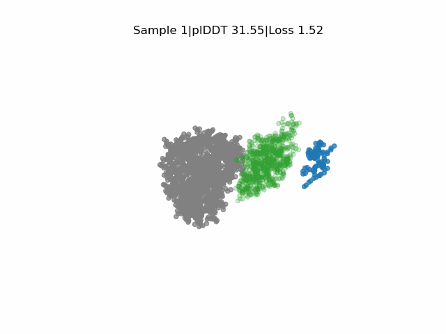

# EvoBindMultimer

**De novo design of macrocyclic molecular glues with EvoBind-multimer**
\
\
EvoBind-multimer (EBM) designs novel linear and **cyclic** peptides bridging two target proteins, only from their amino acid sequences. This makes it possible to design peptide molecular glues that create **ternary complexes**. It is not necessary to specify any target residues within the protein sequence or the length of the peptide (although this is possible).
\
\
We demonstrate molecular glue design with experimental validation between an E3 ligase and a target protein for the degradation of the "undruggable" oncoproteins KRAS and BRD4.
\
\
[Read more here]()
\
\
EvoBind-multimer accounts for adaptation of the receptor interface structures to the peptide being designed during optimization: **sequence and structure is generated simultaneously**. This consideration of flexibility is crucial for binding. EvoBind-multimer is built on the ideas of [EvoBind2](https://github.com/patrickbryant1/EvoBind), the first protocol that only relies on a protein sequence to design a binder with experimentally verified cyclic design capacity.
\
\
<p align="center">
  
  <br>
  <em>The animation illustrates the real-time design trajectory: the target protein KRAS (grey mesh) and the E3 ligase VHL (green) dynamically adapt their interface conformation as the peptide molecular glue (blue) sequence and structure are generated simultaneously.</em>
</p>


# Table of Contents
1.  [EvoBindMultimer](#evobindmultimer)
2.  [LICENSE](#license)
3.  [Colab](#colab)
4.  [Computational requirements](#computational-requirements)
5.  [Setup](#setup)
6.  [Design molecular glues](#design-molecular-glues)
    * [Molecular glues design](#molecular-glues-design)
    * [Adversarial evaluation with AlphaFold-multimer](#adversarial-evaluation-with-alphaFold-multimer)
8. [Citation](#citation)
9. [The EvoBind ecosystem](#the-evobind-ecosystem)


# LICENSE
EvoBindMultimer is based on AlphaFold2, which is available under the [Apache License, Version 2.0](http://www.apache.org/licenses/LICENSE-2.0).  \
The AlphaFold2 parameters are made available under the terms of the [CC BY 4.0 license](https://creativecommons.org/licenses/by/4.0/legalcode) and have not been modified. \
The design protocol EvoBindMultimer is made available under the terms of the [CC BY-NC 4.0 license](https://creativecommons.org/licenses/by-nc/4.0/).
\
**You may not use these files except in compliance with the licenses.**

# Colab
It is possible to run EvoBindMultimer online in the [Google colab here](https://colab.research.google.com/github/DiandraDaum/EvoBindMultimer/blob/main/EvoBindMultimer.ipynb)

# Computational requirements
Before beginning the process of setting up this pipeline on your local system, make sure you have adequate computational resources. Make sure you have an **available GPU** as this will speed up the prediction process substantially compared to using a CPU. EvoBind2 assumes you have NVIDIA GPUs on your system, readily available. A Linux-based system is assumed.

# Setup
To setup this pipeline, clone this github repository:
```
git clone https://github.com/patrickbryant1/EvoBind-multimer.git
```
\
Then do
```
bash setup.sh
```
This script fetches the [AlphaFold2 parameters](https://storage.googleapis.com/alphafold/alphafold_params_2021-07-14.tar), installs a conda env and downloads [uniclust30_2018_08](http://wwwuser.gwdg.de/~compbiol/uniclust/2018_08/uniclust30_2018_08_hhsuite.tar.gz) which is used to generate the receptor MSA.

# Design Peptide Molecular Glues
To design binders the following needs to be specified: \
**target_1_fasta** \
**target_2_fasta** \
Optional arguments:
\
**Peptide length** - default=10 \
**Target residues within the target 1 and/or target 2** - default=all

## Cyclic design
If you want to design a cyclic peptide, add the flag --cyclic_offset=1 in the design script when calling mc_design.py. Based on [cyclic offset](https://www.ncbi.nlm.nih.gov/pmc/articles/PMC9980166/).

A test case is provided in **design_local.sh**. \
This script can be run by simply doing:
```
bash design_local.sh
```

# Citation
If you use EvoBindMultimer in your research, please cite

[Brunner A., Wierbilowicz K., Daumiller D., Li Q., Karlsson K., Sangfelt O. and Bryan P. De novo design of macrocyclic molecular glues from protein sequences. bioRxiv 2026.06..; doi:]()

# The EvoBind ecosystem
[EvoBind](https://github.com/patrickbryant1/EvoBind) - designs novel [cyclic] peptide binders based **only on a protein target sequence**. \
[RareFold](https://github.com/patrickbryant1/RareFold) - prediction & design with noncanonical amino acids \
[RareFoldGPCR](https://github.com/patrickbryant1/RareFoldGPCR) - GPCR agonist design with noncanonical amino acids
